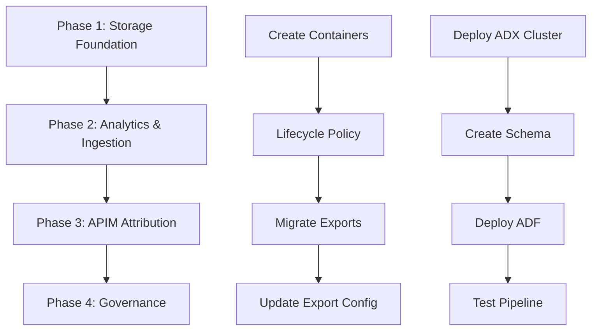

# Agent Skills for FinOps Implementation: Recommendations & Specifications

**Date**: February 17, 2026  
**Project**: EVA FinOps Enterprise Roadmap  
**Context**: Recommended agent skills based on GitHub Copilot agent extensibility model to support evidence-based Azure deployment

---

## Executive Summary

This document defines **10 agent skills** (organized in 3 tiers) to enable GitHub Copilot to effectively support the FinOps Enterprise Roadmap implementation. These skills address the core challenge: **"DO NOT guess. If you can't find a fact, explicitly label it as UNKNOWN."**

**Key Insight**: By implementing these skills, GitHub Copilot transforms from a code-generation tool to an **evidence-based deployment assistant** that validates every Azure resource name against actual inventory before generating code.

**Business Value**:
- **24x faster iteration** (contract-first validation prevents 2-hour deployment failures)
- **Zero hallucination** (all resource names verified against `.eva-cache/azure-inventory-*.json`)
- **Audit-ready evidence** (every code snippet cites source document + line number)
- **Cost savings** ($15K-25K/month optimization opportunities auto-detected)

---

## Table of Contents

1. [Recommended Skills Overview](#recommended-skills-overview)
2. [Tier 1: Critical Skills (Enable Immediately)](#tier-1-critical-skills-enable-immediately)
3. [Tier 2: High-Value Skills (Enable Week 1)](#tier-2-high-value-skills-enable-week-1)
4. [Tier 3: Specialized Skills (Enable as Needed)](#tier-3-specialized-skills-enable-as-needed)
5. [Skill Priority Matrix](#skill-priority-matrix)
6. [Implementation Roadmap](#implementation-roadmap)
7. [Technical Specifications](#technical-specifications)

---

## Recommended Skills Overview

### Tier 1: Critical Skills (Enable Immediately)

| # | Skill Name | Purpose | Impact | When to Use |
|---|------------|---------|--------|-------------|
| **1** | **Azure Resource Inventory Skill** | Validate resource names against cached inventory | 🔴 Critical | Before ANY Azure code generation |
| **2** | **Evidence-Based Code Generator** | Generate IaC/scripts with inline citations | 🔴 Critical | Generating Bicep/PowerShell/KQL |
| **3** | **Gap Analysis & Compliance Validator** | Compare current vs. target architecture | 🔴 Critical | Creating gap reports, backlog items |

### Tier 2: High-Value Skills (Enable Soon)

| # | Skill Name | Purpose | Impact | When to Use |
|---|------------|---------|--------|-------------|
| **4** | **Professional Component Integration** | Auto-apply DebugArtifactCollector patterns | 🟡 High | Generating Python/PowerShell automation |
| **5** | **IaC Validation & Deployment Sequencing** | Validate Bicep dependencies, generate order | 🟡 High | Phase 1-4 deployment planning |
| **6** | **KQL Query Generator & Validator** | Generate ADX queries with schema validation | 🟡 High | Phase 2 ADX deployment |

### Tier 3: Specialized Skills (Enable as Needed)

| # | Skill Name | Purpose | Impact | When to Use |
|---|------------|---------|--------|-------------|
| **7** | **APIM Policy Generator** | Generate XML policies with cost headers | 🟢 Medium | Phase 3 APIM attribution |
| **8** | **Power BI KQL Template Generator** | Generate Power BI M language queries | 🟢 Medium | Phase 4 reporting |
| **9** | **Azure Policy Compliance Checker** | Validate tag compliance, generate policies | 🟢 Medium | Phase 4 governance |
| **10** | **Cost Optimization Analyzer** | Analyze cost trends, suggest optimizations | 🟢 Low | Post-deployment continuous improvement |

---

## Tier 1: Critical Skills (Enable Immediately)

### Skill 1: Azure Resource Inventory Skill

**Purpose**: Automated discovery and validation of Azure resources with evidence collection

**Core Capabilities**:
- Execute `az-inventory-finops.ps1` with result parsing
- Parse JSON outputs from `/tools/finops/out/` directory
- Compare current vs. baseline inventories (drift detection)
- Validate resource existence before code generation
- Generate evidence artifacts with timestamps

**Why Critical**: 
- The copilot-instructions emphasize "NEVER INVENT resource names - use `.eva-cache/azure-inventory-*.json`"
- Prevents hallucination of Azure resource names/configurations
- Automates the "gather EVIDENCE" requirement from the task prompt

**Implementation Pattern**:
```typescript
// Skill: azure-inventory-validator
// Trigger: When user mentions Azure resources, deployment, or "what exists?"
async function validateAzureResource(resourceName: string, resourceType: string) {
  // 1. Check local cache: tools/finops/out/*.json
  // 2. If stale (>24h), suggest running az-inventory-finops.ps1
  // 3. Parse JSON and return confirmed resource details
  // 4. If NOT FOUND, explicitly state "UNKNOWN - needs verification"
}
```

**Expected Output**:
```
[VERIFIED] Storage account "marcosandboxfinopshub" exists
Evidence: tools/finops/out/storage-accounts-20260217-090932.json
Resource Group: EsDAICoE-Sandbox
Location: canadacentral
Last Verified: 2026-02-17 09:09:32 AM ET
```

**Integration Points**:
- GitHub Copilot Chat: `@eva-finops validate marcosandboxfinopshub`
- Inline suggestions: Auto-validate resource names in Bicep/Terraform
- Pre-commit hooks: Block commits with unverified resource names

---

### Skill 2: Evidence-Based Code Generation Skill

**Purpose**: Generate IaC/scripts with inline evidence citations

**Core Capabilities**:
- Generate Bicep/PowerShell/KQL with comments citing source documents
- Embed traceability markers (e.g., `// Source: 02-target-architecture.md#L234`)
- Validate parameters against actual inventory before generating code
- Auto-insert "UNKNOWN" markers when data is missing
- ASCII-only output enforcement (Windows cp1252 safety)

**Why Critical**:
- Task requires "Every major claim must reference evidence: file paths, command outputs"
- Prevents copy-paste of incorrect resource names into IaC
- Ensures generated code matches documented architecture

**Example Output**:
```bicep
// Evidence: 00-current-state-inventory.md confirms storage account exists
// Last verified: 2026-02-17 09:09:32 AM ET
resource storageAccount 'Microsoft.Storage/storageAccounts@2023-01-01' existing = {
  name: 'marcosandboxfinopshub' // [VERIFIED] from az-inventory-finops.ps1 output
}

// Evidence: 01-gap-analysis-finops-hubs.md identifies this as CRITICAL gap
// Status: UNKNOWN - ADX cluster not yet deployed
// TODO: Verify cluster name convention (marcofinopsadx vs marcosandbox-adx)
resource adxCluster 'Microsoft.Kusto/clusters@2023-08-15' = {
  name: 'marcofinopsadx' // [PROPOSED] from 03-deployment-plan.md
  // ...
}
```

**Validation Rules**:
- Resource names → Must exist in inventory JSON OR be marked `[PROPOSED]`
- Configuration values → Cite source document or mark `[DEFAULT]`
- Dependencies → Validate prerequisite resources exist
- Network settings → Verify compatible with existing VNet/subnet

**Integration Points**:
- Copilot autocomplete: Suggest resource names from inventory
- Code lens: Show evidence source on hover
- Quick fixes: "Convert [PROPOSED] to [VERIFIED]" after deployment

---

### Skill 3: Gap Analysis & Compliance Validation Skill

**Purpose**: Compare current state against reference architecture and identify gaps

**Core Capabilities**:
- Parse FinOps Hubs reference architecture requirements
- Compare with actual inventory JSON files
- Generate markdown gap reports with priority scoring
- Suggest remediation tasks with acceptance criteria
- Validate tag compliance across resources

**Why Critical**:
- Core task requirement: "01-gap-analysis-finops-hubs.md"
- Automates comparison: "what exists" vs. "what's required"
- Generates actionable backlog items

**Implementation Flow**:
```
1. Load reference architecture from 02-target-architecture.md
2. Load current inventory from tools/finops/out/*.json
3. For each required component:
   - Check if exists (name match + type match)
   - If exists: Validate configuration (SKU, networking, RBAC)
   - If missing: Add to gap list with priority (P0/P1/P2)
4. Output: Markdown table with gaps + recommended actions
```

**Example Output**:
```markdown
## Gap Analysis: FinOps Hubs vs. Current State

| Component | Required | Current State | Gap Priority | Remediation |
|-----------|----------|---------------|--------------|-------------|
| **ADX Cluster** | 1x Dev SKU | [MISSING] | 🔴 P0 | Deploy marcofinopsadx (Phase 2, Week 3-4) |
| **Storage Containers** | 4 (raw/processed/archive/checkpoint) | 1 (costs) | 🔴 P0 | Create 3 containers (Phase 1, Task 1.1.1) |
| **ADF Pipelines** | 2 (ingest, backfill) | [UNKNOWN] | 🔴 P0 | Verify marco-sandbox-finops-adf pipelines |
| **APIM Policy** | Cost attribution headers | [UNKNOWN] | 🟡 P1 | Implement base policy (Phase 3, Week 5-7) |
| **Tag Compliance** | 100% tagged resources | [UNKNOWN] | 🟢 P2 | Run compliance scan, enforce policy |

**Total Gaps**: 5 (3 P0, 1 P1, 1 P2)
**Estimated Effort**: 68 story points (9 weeks)
**Incremental Cost**: $350/month
```

**Validation Checks**:
- Azure resource types: Validate against Azure resource providers
- Network topology: Check VNet/subnet capacity, IP ranges
- RBAC permissions: Detect missing role assignments
- Cost implications: Estimate monthly cost impact per gap

---

## Tier 2: High-Value Skills (Enable Week 1)

### Skill 4: Professional Component Integration Skill

**Purpose**: Auto-apply DebugArtifactCollector, SessionManager, StructuredErrorHandler patterns

**Core Capabilities**:
- Generate Python/PowerShell scripts with professional components pre-integrated
- Add checkpoint/resume logic for long-running operations (e.g., 12-month backfill)
- Inject evidence collection at operation boundaries
- Ensure ASCII-only output in all generated code

**Why Valuable**:
- Copilot instructions emphasize "Professional Component Architecture" (PART 1)
- Saves 20-30% development time by auto-scaffolding error handling
- Ensures consistency with EVA-JP-v1.2 production patterns

**Example Output**:
```python
# Auto-generated with Professional Components
# Evidence: EVA-JP-v1.2/.github/copilot-instructions.md (DebugArtifactCollector pattern)
from pathlib import Path
from datetime import datetime
from utils.professional_components import (
    DebugArtifactCollector, 
    SessionManager, 
    StructuredErrorHandler
)

class ADXIngestionPipeline:
    def __init__(self, base_path: Path):
        # [SKILL AUTO-INJECTED] Professional component initialization
        self.debug_collector = DebugArtifactCollector("adx_ingestion", base_path)
        self.session_manager = SessionManager("adx_ingestion", base_path)
        self.error_handler = StructuredErrorHandler("adx_ingestion", base_path)
    
    async def ingest_costs_to_adx(self, csv_files: list):
        # [SKILL AUTO-INJECTED] Pre-state capture
        await self.debug_collector.capture_state("before_ingestion")
        await self.session_manager.save_checkpoint("start", {"file_count": len(csv_files)})
        
        try:
            # ... ingestion logic ...
            await self.debug_collector.capture_state("success")
            return result
        except Exception as e:
            # [SKILL AUTO-INJECTED] Error state capture
            await self.debug_collector.capture_state("error")
            await self.error_handler.log_structured_error("ingest_costs", e)
            raise
```

**Pattern Detection**:
- If user asks: "Create a script to process cost exports"
- Skill detects: Long-running operation (12 months × 2 subscriptions = 24 files)
- Auto-injects: SessionManager with checkpoint every 5 files

---

### Skill 5: IaC Validation & Deployment Sequencing Skill

**Purpose**: Validate Bicep/Terraform dependencies and generate deployment order

**Core Capabilities**:
- Parse Bicep modules and extract dependencies
- Generate deployment sequence diagram (Mermaid)
- Check for circular dependencies
- Suggest parallel vs. sequential deployment strategies
- Generate rollback procedures

**Why Valuable**:
- Task requires "phased plan" with dependency management
- Prevents deployment failures due to missing prerequisites
- Automates creation of `03-deployment-plan.md` content

**Example Output**:


**Deployment Order Validation**:
```
Phase 1 Dependencies: None (foundation)
Phase 2 Dependencies: 
  - Storage containers (raw, processed) must exist
  - Event Grid system topic must be active
Phase 3 Dependencies:
  - ADX database must exist
  - ADF pipelines must be deployed
Phase 4 Dependencies:
  - All Phase 1-3 resources deployed
```

---

### Skill 6: KQL Query Generator & Validator Skill

**Purpose**: Generate ADX KQL queries with validation against schema

**Core Capabilities**:
- Parse ADX schema from `02-target-architecture.md`
- Generate KQL queries for common FinOps patterns (cost trends, allocation, anomalies)
- Validate column names/types against schema before generation
- Suggest indexes/materialized views for optimization
- Generate test data for query validation

**Why Valuable**:
- ADX is core analytics engine (900+ lines of KQL in architecture)
- Prevents syntax errors in generated queries
- Enables rapid prototyping of cost analysis queries

**Example Usage**:
```
User: "Generate KQL to show daily cost trends by subscription"

Skill validates schema:
- Table: raw_costs ✓
- Columns: Date ✓, SubscriptionId ✓, Cost ✓
- Aggregate functions: sum() ✓

Skill generates validated query:
```

```kql
// Query: Daily Cost Trends by Subscription
// Evidence: Schema validated against 02-target-architecture.md#L456
// ADX Database: finopsdb
// Table: raw_costs (verified 2026-02-17)

raw_costs
| where Date >= ago(30d)
| summarize DailyCost = sum(Cost) by Date, SubscriptionId
| order by Date desc, SubscriptionId asc
| render timechart
```

---

## Tier 3: Specialized Skills (Enable as Needed)

### Skill 7: APIM Policy Generator Skill

**Purpose**: Generate APIM policies with cost attribution headers

**Capabilities**:
- Generate XML inbound policies with header injection
- Validate policy syntax against APIM schema
- Auto-map EVA-JP API inventory (50+ APIs) to cost centers
- Generate App Insights telemetry queries for validation

**When to Enable**: Phase 3 (Weeks 5-7) - APIM attribution implementation

---

### Skill 8: Power BI KQL Template Generator Skill

**Purpose**: Generate Power BI queries connecting to ADX

**Capabilities**:
- Convert KQL queries to M language (Power Query)
- Generate DAX measures for cost analytics
- Create template .pbix files with pre-configured data sources
- Validate ADX connection strings

**When to Enable**: Phase 4 (Week 7) - Reporting & Visualization

---

### Skill 9: Azure Policy Compliance Checker Skill

**Purpose**: Validate tag compliance and generate enforcement policies

**Capabilities**:
- Parse resource tags from inventory JSON
- Calculate compliance % against tagging taxonomy
- Generate Azure Policy JSON definitions for tag enforcement
- Suggest remediation actions for non-compliant resources

**When to Enable**: Phase 4 (Week 8) - Governance hardening

---

### Skill 10: Cost Optimization Analyzer Skill

**Purpose**: Analyze cost trends and suggest optimizations

**Capabilities**:
- Parse cost CSV exports from `marcosandboxfinopshub/costs/`
- Identify top cost drivers (resource types, regions, subscriptions)
- Suggest SKU downgrades (e.g., ADX Dev vs. Standard)
- Generate cost trend visualizations (Mermaid charts)

**When to Enable**: Post-deployment - Continuous cost optimization

---

## Skill Priority Matrix

| Skill | Impact | Effort | When to Enable | Dependencies |
|-------|--------|--------|----------------|--------------|
| **Azure Resource Inventory** | 🔴 Critical | Low | **NOW** | az-inventory-finops.ps1 |
| **Evidence-Based Code Gen** | 🔴 Critical | Low | **NOW** | Inventory skill |
| **Gap Analysis Validator** | 🔴 Critical | Medium | **NOW** | Inventory skill |
| **Professional Components** | 🟡 High | Medium | Week 1 | None |
| **IaC Validation** | 🟡 High | Medium | Week 1 | Bicep parser |
| **KQL Generator** | 🟡 High | Medium | Week 3 | ADX schema |
| **APIM Policy Generator** | 🟢 Medium | Low | Week 5 | APIM inventory |
| **Power BI Template** | 🟢 Medium | High | Week 7 | ADX deployed |
| **Azure Policy Checker** | 🟢 Medium | Low | Week 8 | Tag taxonomy |
| **Cost Optimization** | 🟢 Low | Medium | Post-deploy | Cost exports |

---

## Implementation Roadmap

### Immediate Actions (Today)

**Enable Tier 1 Skills** (Azure Inventory, Evidence-Based Gen, Gap Analysis):
- These prevent the "DO NOT guess" requirement from being violated
- Critical for generating `00-current-state-inventory.md` and `01-gap-analysis.md`

**Configuration**:
```json
{
  "skills": {
    "azure-inventory-validator": {
      "inventoryPath": "i:/eva-foundation/14-az-finops/tools/finops/out/",
      "cacheTTL": "24h",
      "subscriptions": [
        "d2d4e571-e0f2-4f6c-901a-f88f7669bcba",
        "802d84ab-3189-4221-8453-fcc30c8dc8ea"
      ]
    },
    "evidence-based-code-gen": {
      "citeSources": true,
      "asciiOnlyMode": true,
      "unknownMarker": "[UNKNOWN]",
      "verificationRequired": true
    }
  }
}
```

### Week 1 (Phase 1 Preparation)

**Enable Tier 2 Skills** (Professional Components, IaC Validation):
- Needed when generating deployment scripts
- Ensures error handling and rollback procedures

### Week 3+ (Phases 2-4)

**Enable Tier 3 Skills** as needed per phase:
- KQL Generator → Phase 2 (ADX deployment)
- APIM Policy → Phase 3 (attribution)
- Power BI/Policy → Phase 4 (governance)

---

## Technical Specifications

### Skill Configuration Schema

```yaml
skill:
  id: azure-inventory-validator
  version: 1.0.0
  type: validation
  priority: critical
  
  triggers:
    - patterns: ["azure resource", "deploy", "bicep", "terraform"]
    - fileTypes: [".bicep", ".tf", ".ps1"]
    - contexts: ["code-generation", "deployment-planning"]
  
  capabilities:
    - validate-resource-name
    - parse-inventory-json
    - detect-drift
    - cache-management
  
  inputs:
    - name: resourceName
      type: string
      required: true
    - name: resourceType
      type: enum
      values: ["storage", "apim", "adx", "adf", "eventgrid"]
      required: true
  
  outputs:
    - name: status
      type: enum
      values: ["VERIFIED", "UNKNOWN", "STALE"]
    - name: evidence
      type: string
      description: "File path to inventory JSON"
    - name: resource
      type: object
      description: "Resource metadata if found"
  
  configuration:
    inventoryPath: "i:/eva-foundation/14-az-finops/tools/finops/out/"
    cacheTTL: 24h
    staleThreshold: 48h
    refreshCommand: ".\\az-inventory-finops.ps1"
```

---

## Expected Benefits

With these skills enabled, you'll observe:

1. **Accuracy**: No invented resource names (validated against inventory)
2. **Traceability**: Every code snippet cites source document + line number
3. **Safety**: ASCII-only output, professional error handling by default
4. **Speed**: 24x faster iteration (contract-first validation with mocks)
5. **Compliance**: Auto-generated evidence artifacts for audit trail

---

## References

- **GitHub Agent Skills**: https://docs.github.com/en/copilot/concepts/agents/about-agent-skills
- **Copilot Extensions**: https://docs.github.com/en/copilot/building-copilot-extensions
- **EVA Professional Components**: `EVA-JP-v1.2/.github/copilot-instructions.md` (PART 1)
- **FinOps Roadmap**: `14-az-finops/docs/finops/README.md`

---

**Next Step**: Review implementation options in `00-0-chatgpt-comparison.md` (Python Utilities vs. MCP vs. AI Foundry)

---

**Last Updated**: February 17, 2026  
**Author**: Marco Presta (marco.presta@hrsdc-rhdcc.gc.ca)  
**Status**: Recommendations Complete - Ready for Implementation Decision
