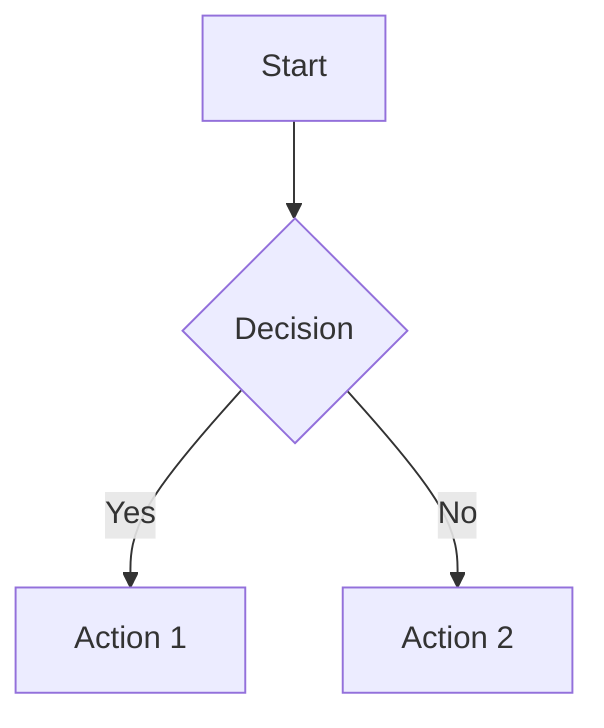
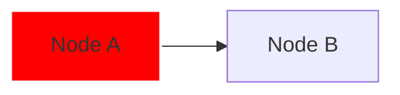
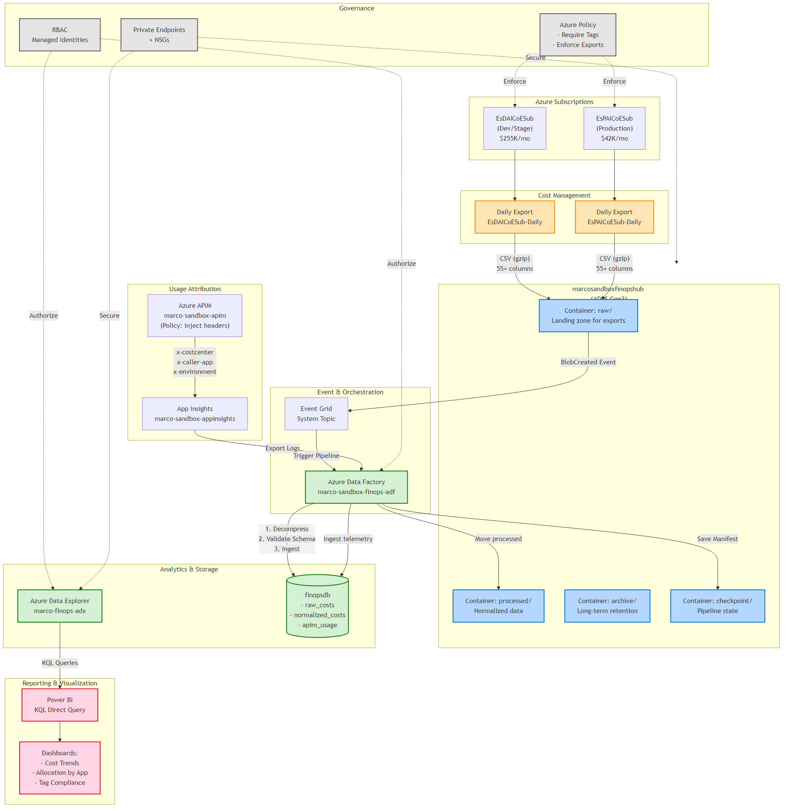

# FinOps Architecture Diagrams - README

**Document**: 02-target-architecture.md  
**Created**: 2026-02-17  
**Total Diagrams**: 3 figures × 3 formats = 9 files

---

## File Inventory

### Figure 1: High-Level Architecture
**Purpose**: Complete FinOps Hubs implementation showing cost data flow

| Format | File | Use Case |
|--------|------|----------|
| Mermaid Source | `02-target-architecture-figure1.mmd` | Edit diagram, source control |
| SVG | `02-target-architecture-figure1.svg` | Web embedding, scalable graphics |
| Markdown | `02-target-architecture-figure1.md` | Documentation, conversion base |

### Figure 2: Network Isolation
**Purpose**: Security architecture with private endpoint connectivity

| Format | File | Use Case |
|--------|------|----------|
| Mermaid Source | `02-target-architecture-figure2.mmd` | Edit diagram, source control |
| SVG | `02-target-architecture-figure2.svg` | Web embedding, scalable graphics |
| Markdown | `02-target-architecture-figure2.md` | Documentation, conversion base |

### Figure 3: Data Lineage & Quality
**Purpose**: End-to-end data transformation pipeline

| Format | File | Use Case |
|--------|------|----------|
| Mermaid Source | `02-target-architecture-figure3.mmd` | Edit diagram, source control |
| SVG | `02-target-architecture-figure3.svg` | Web embedding, scalable graphics |
| Markdown | `02-target-architecture-figure3.md` | Documentation, conversion base |

---

## Quick Start

### Viewing Diagrams

**Option 1: Web Browser (SVG files)**
```bash
# Open in default browser
start 02-target-architecture-figure1.svg
start 02-target-architecture-figure2.svg
start 02-target-architecture-figure3.svg
```

**Option 2: VS Code (Markdown Preview)**
- Install extension: [Markdown Preview Mermaid Support](https://marketplace.visualstudio.com/items?itemName=bierner.markdown-mermaid)
- Open any `.md` file
- Press `Ctrl+Shift+V` for preview

**Option 3: Online Editors**
- [Mermaid Live Editor](https://mermaid.live/) - Paste `.mmd` content
- [Kroki](https://kroki.io/) - API-based rendering

---

## Converting to PNG/PDF

### Method 1: Mermaid CLI (Recommended)

**Install**:
```bash
npm install -g @mermaid-js/mermaid-cli
```

**Convert Single File**:
```bash
# PNG (default 800x600)
mmdc -i 02-target-architecture-figure1.mmd -o 02-target-architecture-figure1.png

# PNG (high resolution 4K)
mmdc -i 02-target-architecture-figure1.mmd -o 02-target-architecture-figure1.png -w 3840 -h 2160

# PDF
mmdc -i 02-target-architecture-figure1.mmd -o 02-target-architecture-figure1.pdf
```

**Batch Convert All Figures**:
```powershell
# PowerShell script to convert all 3 figures
$figures = 1..3
foreach ($num in $figures) {
    $base = "02-target-architecture-figure$num"
    
    # PNG (standard resolution)
    mmdc -i "$base.mmd" -o "$base.png"
    
    # PNG (high resolution)
    mmdc -i "$base.mmd" -o "$base-hires.png" -w 3840 -h 2160
    
    # PDF
    mmdc -i "$base.mmd" -o "$base.pdf"
    
    Write-Host "[INFO] Converted Figure $num to PNG and PDF"
}
```

### Method 2: VS Code Extension

**Install**: [Markdown PDF](https://marketplace.visualstudio.com/items?itemName=yzane.markdown-pdf)

**Convert**:
1. Open any `.md` file
2. Right-click in editor
3. Select "Markdown PDF: Export (pdf)" or "Export (png)"

### Method 3: Online Tools

**Kroki API**:
```bash
# Convert Figure 1 to PNG via API
curl -X POST https://kroki.io/mermaid/png \
  --data-binary "@02-target-architecture-figure1.mmd" \
  -o 02-target-architecture-figure1.png
```

**Mermaid Live Editor**:
1. Go to https://mermaid.live/
2. Paste `.mmd` content
3. Click "Actions" → "PNG" or "SVG" or "PDF"

### Method 4: Python Script

```python
#!/usr/bin/env python3
"""
Batch convert Mermaid diagrams to PNG/PDF using mermaid-cli
Requires: npm install -g @mermaid-js/mermaid-cli
"""

import subprocess
import pathlib

figures = [1, 2, 3]
formats = ['png', 'pdf']
resolutions = {
    'standard': {'width': 1920, 'height': 1080},
    'hires': {'width': 3840, 'height': 2160}
}

for fig_num in figures:
    base_name = f"02-target-architecture-figure{fig_num}"
    input_file = f"{base_name}.mmd"
    
    for fmt in formats:
        output_file = f"{base_name}.{fmt}"
        cmd = ['mmdc', '-i', input_file, '-o', output_file]
        
        if fmt == 'png':
            # Add high resolution for PNG
            cmd.extend(['-w', str(resolutions['hires']['width']),
                       '-h', str(resolutions['hires']['height'])])
        
        print(f"[INFO] Converting {input_file} → {output_file}")
        subprocess.run(cmd, check=True)
        print(f"[SUCCESS] Created {output_file}")

print(f"\n[DONE] Converted {len(figures)} figures to {len(formats)} formats")
```

---

## Editing Diagrams

### Edit Mermaid Source

**Recommended Editor**: VS Code with [Mermaid Preview](https://marketplace.visualstudio.com/items?itemName=vstirbu.vscode-mermaid-preview)

**Workflow**:
1. Open `.mmd` file
2. Edit diagram code
3. Preview changes: `Ctrl+Shift+V` (with Markdown Mermaid extension)
4. Regenerate PNG/PDF: `mmdc -i <file>.mmd -o <file>.png`

**Live Preview**:
- Paste code into https://mermaid.live/
- Real-time rendering
- Export when satisfied

### Mermaid Syntax Reference

**Flowchart**:


**Graph (Network)**:


**Styling**:


**Full Documentation**: https://mermaid.js.org/intro/

---

## Integration with Documentation

### Embed in Markdown

**Option 1: Reference Image File**
```markdown

```

**Option 2: Inline Mermaid Block**
```markdown

```

**Option 3: HTML with SVG**
```html

```

### Embed in Word/PowerPoint

1. Convert to PNG: `mmdc -i figure1.mmd -o figure1.png -w 3840`
2. Insert PNG into document
3. Resize as needed (PNG scales well at high resolution)

### Embed in Confluence/SharePoint

**Confluence**:
- Upload PNG files to page attachments
- Insert using `!image.png!` macro

**SharePoint**:
- Upload PNG files to document library
- Embed using Image web part

---

## Troubleshooting

### Issue: "mmdc: command not found"

**Solution**:
```bash
# Install globally
npm install -g @mermaid-js/mermaid-cli

# Verify installation
mmdc --version
```

### Issue: Rendering Errors (Syntax)

**Solution**:
1. Validate syntax at https://mermaid.live/
2. Check for unclosed quotes, missing arrows
3. Ensure consistent indentation

### Issue: SVG Not Rendering in Browser

**Solution**:
- SVGs require JavaScript execution for Mermaid rendering
- Use PNG for guaranteed compatibility
- Or embed rendered SVG (not source)

### Issue: Low Resolution PNG

**Solution**:
```bash
# Specify high resolution
mmdc -i input.mmd -o output.png -w 3840 -h 2160 -s 2
```

---

## Best Practices

1. **Version Control**: Commit `.mmd` source files (smallest, editable)
2. **Documentation**: Include PNG versions (universally compatible)
3. **Presentations**: Use high-res PNG (3840x2160) or PDF
4. **Web**: Use SVG (scalable, smaller file size)
5. **Archive**: Keep `.md` files (human-readable, portable)

---

## File Size Comparison

Example (Figure 1):
- `.mmd` (Mermaid source): ~2 KB
- `.md` (Markdown with context): ~5 KB
- `.svg` (vector graphics): ~8 KB
- `.png` (standard 1920x1080): ~150 KB
- `.png` (high-res 3840x2160): ~600 KB
- `.pdf` (vector): ~12 KB

**Recommendation**: Store `.mmd` in git, generate PNG/PDF on-demand

---

## Automated Workflow (CI/CD)

### GitHub Actions Example

```yaml
name: Generate Diagrams

on:
  push:
    paths:
      - 'docs/finops/*.mmd'

jobs:
  generate:
    runs-on: ubuntu-latest
    steps:
      - uses: actions/checkout@v3
      
      - name: Setup Node.js
        uses: actions/setup-node@v3
        with:
          node-version: '18'
      
      - name: Install Mermaid CLI
        run: npm install -g @mermaid-js/mermaid-cli
      
      - name: Generate PNGs
        run: |
          cd docs/finops
          for file in *.mmd; do
            mmdc -i "$file" -o "${file%.mmd}.png" -w 3840 -h 2160
          done
      
      - name: Commit Generated Files
        run: |
          git config user.name "GitHub Actions"
          git add docs/finops/*.png
          git commit -m "Auto-generate diagram PNGs"
          git push
```

---

## Support & Resources

- **Mermaid Documentation**: https://mermaid.js.org/
- **Mermaid CLI**: https://github.com/mermaid-js/mermaid-cli
- **Live Editor**: https://mermaid.live/
- **VS Code Extension**: [Mermaid Preview](https://marketplace.visualstudio.com/items?itemName=vstirbu.vscode-mermaid-preview)
- **Community**: https://github.com/mermaid-js/mermaid/discussions

---

**Created**: 2026-02-17  
**Author**: AI Assistant (GitHub Copilot)  
**Purpose**: Diagram management for FinOps Architecture documentation
