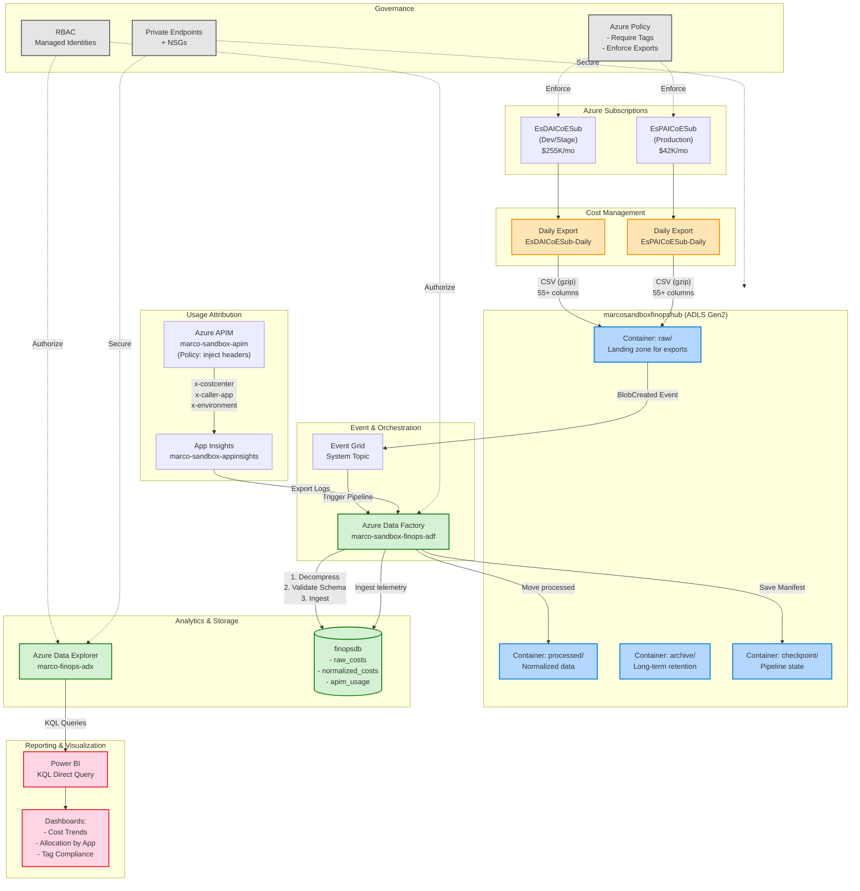

# Figure 1: FinOps Hub High-Level Architecture

**Document**: 02-target-architecture.md  
**Type**: Flowchart  
**Purpose**: Complete FinOps Hubs implementation showing cost data flow from Azure subscriptions through ingestion, analytics, attribution, and reporting.

---

## Diagram



---

## Key Components

1. **Azure Subscriptions**: EsDAICoESub (Dev/Stage $255K/mo), EsPAICoESub (Production $42K/mo)
2. **Cost Management**: Daily exports in CSV.gz format with 55+ columns
3. **Landing Zone**: ADLS Gen2 hierarchical storage (raw → processed → archive)
4. **Event Orchestration**: Event Grid triggers ADF pipelines on blob creation
5. **Analytics**: Azure Data Explorer (ADX) with KQL query engine
6. **Usage Attribution**: APIM policies inject caller headers for cost allocation
7. **Reporting**: Power BI DirectQuery dashboards
8. **Governance**: Azure Policy enforcement, RBAC, private endpoints

---

## Color Legend

- **Orange** (#FFE5B4): Cost Management resources
- **Blue** (#B4D7FF): Storage resources
- **Green** (#D4F1D4): Compute/Analytics resources
- **Pink** (#FFD4E5): Reporting resources
- **Gray** (#E5E5E5): Governance/Security controls

---

**Conversion Instructions**:

To convert this markdown file to PNG or PDF:

```bash
# Using mermaid-cli (mmdc)
npm install -g @mermaid-js/mermaid-cli
mmdc -i 02-target-architecture-figure1.md -o 02-target-architecture-figure1.png
mmdc -i 02-target-architecture-figure1.md -o 02-target-architecture-figure1.pdf

# Or use online tools
# https://mermaid.live/
# https://kroki.io/
```
