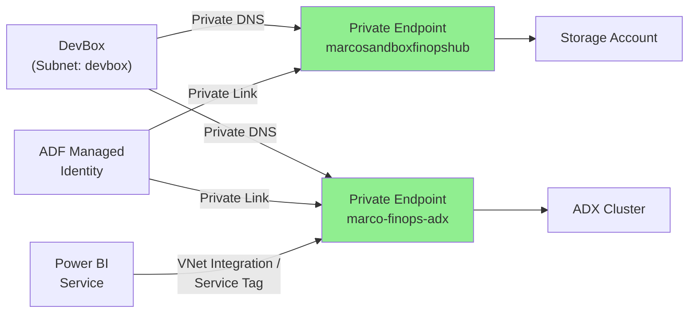

# Figure 2: Network Isolation Architecture

**Document**: 02-target-architecture.md  
**Type**: Graph  
**Purpose**: Security architecture showing private endpoint connectivity between clients (DevBox, ADF, Power BI) and Azure services (Storage, ADX).

---

## Diagram



---

## Key Components

### Client Access Points
1. **DevBox** (Subnet: devbox) - Developer/operator workstation access
2. **ADF Managed Identity** - Pipeline execution with system-assigned identity
3. **Power BI Service** - Report query execution via VNet integration

### Security Layer
4. **Private Endpoint (Storage)** - marcosandboxfinopshub private link
5. **Private Endpoint (ADX)** - marco-finops-adx private link

### Backend Services
6. **Storage Account** - ADLS Gen2 with hierarchical namespace
7. **ADX Cluster** - Azure Data Explorer analytics engine

---

## Network Flow

1. **DevBox Access**:
   - Uses Private DNS resolution
   - Traffic never leaves Azure backbone
   - Access controlled via NSG + RBAC

2. **ADF Pipeline Access**:
   - Managed Identity authentication
   - Private Link connectivity
   - No public IP exposure

3. **Power BI Service**:
   - VNet Integration (when available)
   - Service Tag-based firewall rules
   - DirectQuery over private network

---

## Security Benefits

- **No Public Exposure**: All data access goes through private endpoints
- **Private DNS**: Automatic resolution of private IPs
- **Zero Trust**: Identity-based access (no network-based trust)
- **Audit Trail**: All connections logged via Azure Monitor

---

## Color Legend

- **Green** (#90EE90): Private Endpoint resources (security layer)

---

**Conversion Instructions**:

To convert this markdown file to PNG or PDF:

```bash
# Using mermaid-cli (mmdc)
npm install -g @mermaid-js/mermaid-cli
mmdc -i 02-target-architecture-figure2.md -o 02-target-architecture-figure2.png
mmdc -i 02-target-architecture-figure2.md -o 02-target-architecture-figure2.pdf

# Or use online tools
# https://mermaid.live/
# https://kroki.io/
```
