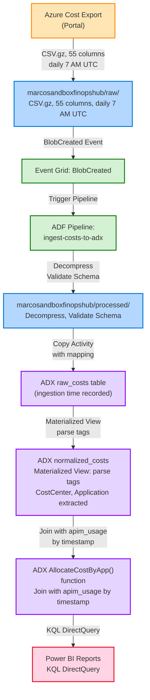

# Figure 3: Data Lineage and Quality Tracking

**Document**: 02-target-architecture.md  
**Type**: Flowchart (Top-Down)  
**Purpose**: End-to-end data lineage showing transformation stages from Azure Cost Export to Power BI reports with quality gates.

---

## Diagram



---

## Data Flow Stages

### Stage 1: Export Generation
- **Source**: Azure Cost Management portal
- **Output**: CSV.gz files with 55+ columns
- **Schedule**: Daily at 7 AM UTC
- **Destination**: `marcosandboxfinopshub/raw/costs/`

### Stage 2: Event Detection
- **Trigger**: Event Grid system topic
- **Event Type**: `Microsoft.Storage.BlobCreated`
- **Filter**: Prefix `/raw/costs/`, Suffix `.csv.gz`

### Stage 3: Pipeline Orchestration
- **Component**: Azure Data Factory
- **Pipeline**: `ingest-costs-to-adx`
- **Activities**: Decompress, validate schema, copy to ADX

### Stage 4: Raw Ingestion
- **Destination**: ADX `raw_costs` table
- **Metadata**: Ingestion timestamp recorded
- **Retention**: 5 years (1825 days)

### Stage 5: Normalization
- **Component**: ADX materialized view
- **Transform**: Parse JSON tags → extract CostCenter, Application, Environment
- **Output**: `normalized_costs` table

### Stage 6: Attribution
- **Component**: ADX function `AllocateCostByApp()`
- **Join**: Cost data + APIM usage telemetry
- **Output**: Cost per CallerApp per hour

### Stage 7: Reporting
- **Component**: Power BI
- **Query Mode**: DirectQuery (live KQL queries)
- **Dashboards**: Cost Trends, Allocation by App, Tag Compliance

---

## Quality Gates

| Stage | Check | Abort Condition |
|-------|-------|-----------------|
| **Export** | File size > 0 KB | Empty file → Skip (holiday, no usage) |
| **Decompression** | Uncompressed size < 10x | Corrupt .gz → Dead-letter |
| **Schema Validation** | Column count == 55±5 | Schema mismatch → Alert & Skip |
| **ADX Ingestion** | Row count > 0 | Zero rows after mapping → Investigation |
| **Allocation** | APIM telemetry join yield < 80% | Missing headers → Policy audit |

---

## Color Legend

- **Orange** (#FFE5B4): Source systems (Cost Management)
- **Blue** (#B4D7FF): Storage layers (raw, processed)
- **Green** (#D4F1D4): Processing engines (Event Grid, ADF)
- **Purple** (#E5D4FF): Analytics engines (ADX tables, functions)
- **Pink** (#FFD4E5): Reporting systems (Power BI)

---

## Checkpoint Tracking

At each stage, metadata is recorded:

```json
{
  "blobUrl": "https://marcosandboxfinopshub.blob.core.windows.net/raw/costs/...",
  "ingestTime": "2026-02-17T08:30:00Z",
  "rowCount": 45623,
  "status": "SUCCESS",
  "pipelineRunId": "a1b2c3d4-...",
  "validationChecks": {
    "columnCount": 55,
    "schemaVersion": "2024-08-01",
    "dateRange": "2026-02-16"
  }
}
```

Stored in: `marcosandboxfinopshub/checkpoint/ingestion_manifest.json`

---

**Conversion Instructions**:

To convert this markdown file to PNG or PDF:

```bash
# Using mermaid-cli (mmdc)
npm install -g @mermaid-js/mermaid-cli
mmdc -i 02-target-architecture-figure3.md -o 02-target-architecture-figure3.png
mmdc -i 02-target-architecture-figure3.md -o 02-target-architecture-figure3.pdf

# Or use online tools
# https://mermaid.live/
# https://kroki.io/
```
