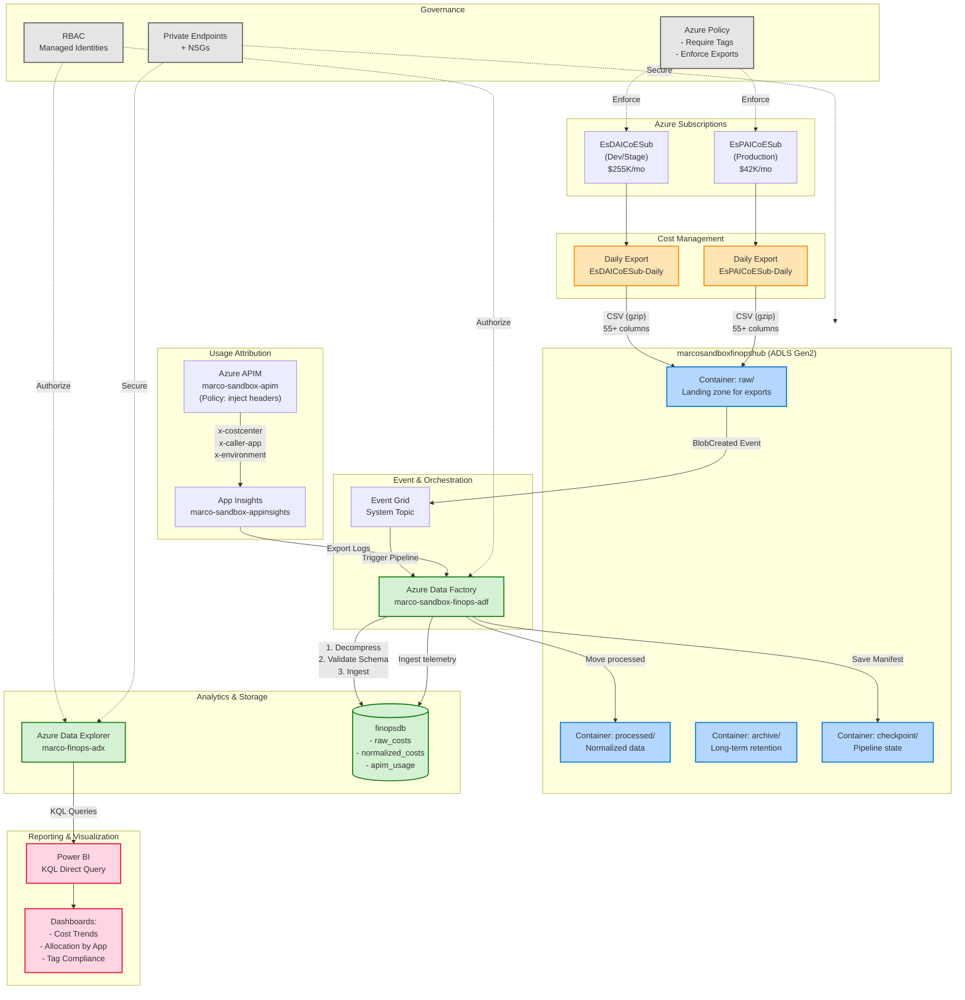
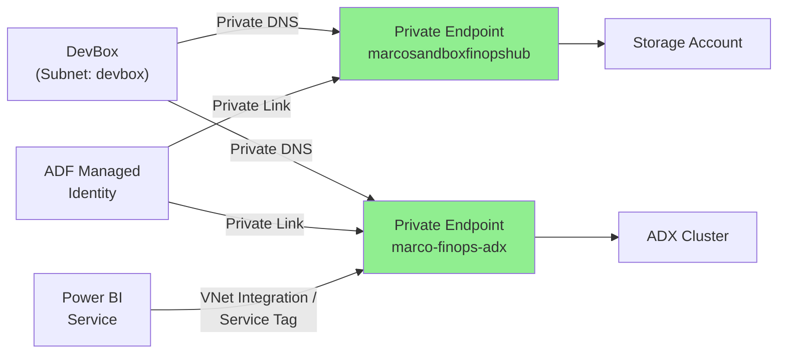

# 02 - Target Architecture (marcosandbox FinOps Hubs)

**Document Type**: Architecture  
**Phase**: Design  
**Audience**: [architects, engineers, security]  
**Last Updated**: 2026-02-17 08:20 AM ET  
**Author**: Marco Presta (marco.presta@hrsdc-rhdcc.gc.ca)  
**Reference**: Microsoft FinOps Toolkit v0.3, Azure Well-Architected Framework

---

## Architecture Overview

The target architecture implements a centralized FinOps Hubs pattern with cost data ingestion, normalization, usage attribution via APIM telemetry, and Power BI reporting—all following enterprise security best practices (least-privilege RBAC, private networking, audit logging).

**Design Principles**:
1. **Event-Driven**: Storage events trigger automated ingestion (no scheduled polling)
2. **Scalable**: ADX handles millions of cost records with sub-second KQL queries
3. **Attributable**: APIM policies inject caller identity for chargeback/showback
4. **Auditable**: All transformations logged; lineage tracked via checkpoint manifests
5. **Secure**: Private endpoints, managed identities, no exposed credentials

---

## High-Level Architecture Diagram



---

## Component Details

### 1. Azure Cost Management Exports

**Purpose**: Generate daily cost and usage data at resource-level granularity.

| Export | Subscription | Frequency | Format | Destination |
|--------|-------------|-----------|--------|-------------|
| EsDAICoESub-Daily | d2d4e571-... | Daily 7 AM UTC | CSV (gzip) | marcosandboxfinopshub/raw/costs/EsDAICoESub/{YYYY}/{MM}/ |
| EsPAICoESub-Daily | 802d84ab-... | Daily 7 AM UTC | CSV (gzip) | marcosandboxfinopshub/raw/costs/EsPAICoESub/{YYYY}/{MM}/ |

**Configuration**:
- Type: ActualCost (includes taxes, reservations, Marketplace)
- Schema Version: 2024-08-01 (55+ columns)
- Partition: Daily (one file per day)
- Retention: In-place (no auto-delete; managed by lifecycle policy)

**Schema Highlights** (key columns):
- `Date`, `SubscriptionName`, `ResourceGroup`, `ResourceId`
- `CostInBillingCurrency`, `EffectivePrice`, `Quantity`
- `MeterCategory`, `MeterSubCategory`, `MeterName`
- `Tags` (JSON string: `{"CostCenter":"X","Application":"Y"}`)
- `ConsumedService`, `ResourceLocation`, `PricingModel`

---

### 2. ADLS Gen2 Storage (marcosandboxfinopshub)

**Purpose**: Centralized landing zone with hierarchical namespace for cost data at multiple processing stages.

**Container Structure**:

```
marcosandboxfinopshub/
│
├── raw/costs/
│   ├── EsDAICoESub/
│   │   ├── 2025/
│   │   │   ├── 02/
│   │   │   │   ├── 20250201-20250201/{guid}/part_0_0001.csv.gz
│   │   │   │   ├── 20250202-20250202/{guid}/part_0_0001.csv.gz
│   │   │   │   └── ...
│   │   │   ├── 03/
│   │   │   └── ...
│   │   └── 2026/
│   │       └── ...
│   └── EsPAICoESub/
│       └── (same structure)
│
├── processed/costs/
│   ├── EsDAICoESub_{YYYY}{MM}{DD}.csv  (decompressed, validated)
│   └── EsPAICoESub_{YYYY}{MM}{DD}.csv
│
├── archive/costs/
│   └── (moved after 180 days via lifecycle policy)
│
└── checkpoint/
    ├── ingestion_manifest.json  (last processed blob URL + timestamp)
    └── pipeline_state.json      (high-water mark for backfill)
```

**Network Configuration** (target):
- Public access: Disabled
- Private endpoint: Enabled (VNet: vnet-finops-canadacentral)
- Firewall: Allow only ADF managed identity, DevBox subnet, Power BI service
- Encryption: Microsoft-managed keys (or Customer-managed key if required)

**Lifecycle Management**:
- Tier `raw/` to Cool after 90 days
- Move `archive/` to Archive tier after 180 days
- Delete after 7 years (compliance requirement)

---

### 3. Event Grid System Topic

**Purpose**: React to blob creation events and trigger ADF ingestion pipeline.

**Configuration**:
- **Name**: `marcosandboxfinopshub-52dd1c15-63a9-48a2-842e-97bda61d811f` (existing)
- **Source**: Microsoft.Storage.StorageAccounts (marcosandboxfinopshub)
- **Event Types**: `Microsoft.Storage.BlobCreated`
- **Filter**: Prefix `/raw/costs/`, Suffix `.csv.gz`

**Event Subscription** (to create):
- **Name**: `finops-ingest-trigger`
- **Endpoint Type**: Azure Data Factory pipeline webhook
- **Destination**: Pipeline `ingest-costs-to-adx`, parameter `blobUrl`
- **Retry Policy**: Max 10 retries, 24-hour event TTL

---

### 4. Azure Data Factory (marco-sandbox-finops-adf)

**Purpose**: Orchestrate data movement, transformation, and quality checks.

#### Pipeline 1: `ingest-costs-to-adx`

**Trigger**: Event Grid (blob created)

**Activities**:
1. **Get Blob Metadata** (Web activity)
   - Retrieve blob size, ETag, creation time
   - Log to checkpoint for idempotency

2. **Decompress CSV** (Custom activity / Azure Function)
   - Extract .gz to memory stream
   - Write decompressed CSV to `processed/`

3. **Validate Schema** (Data flow / Python activity)
   - Check column count (expected 55+)
   - Validate date format, numeric columns
   - Abort if validation fails

4. **Copy to ADX** (Copy activity)
   - Source: Processed CSV blob
   - Sink: ADX table `raw_costs`
   - Mapping: Use ingestion mapping `CostExportMapping`

5. **Update Checkpoint** (Set variable + Blob write)
   - Write manifest: `{blobUrl, ingestTime, rowCount, status}`
   - Increment high-water mark

6. **Move to Archive** (Delete activity, conditional)
   - If blob age > 180 days, move to `archive/` container

**Error Handling**:
- On failure: Log to App Insights, send email alert
- Retry: 3 attempts with exponential backoff
- Dead-letter: Write failed blobs to `checkpoint/failed/`

#### Pipeline 2: `backfill-historical`

**Trigger**: Manual or scheduled (one-time)

**Activities**:
1. **List Blobs** (Get Metadata activity)
   - Source: `raw/costs/` with recursive scan
   - Filter: Only `.csv.gz`, ascending by blob name

2. **ForEach Blob** (ForEach activity)
   - Parallel: 5 concurrent executions
   - Execute pipeline: `ingest-costs-to-adx` with blob URL parameter

3. **Progress Tracking** (Set variable)
   - Update `pipeline_state.json` every 100 blobs

**Performance**: ~500 blobs (1 year daily exports × 2 subs) in ~2 hours.

#### Pipeline 3: `enrich-and-normalize` (Optional)

**Trigger**: Scheduled (daily 2 AM, after exports complete)

**Activities**:
1. **Read from ADX** (`raw_costs` table, yesterday's data)
2. **Parse Tags** (Data flow with JSON parse)
   - Extract `CostCenter`, `Application`, `Environment` from `Tags` column
3. **Apply Business Rules** (Data flow transformation)
   - Map resource groups to owning teams
   - Allocate shared costs (e.g., VNet split equally across apps)
4. **Write to `normalized_costs`** (Copy activity)

---

### 5. Azure Data Explorer (ADX)

**Purpose**: High-performance analytics engine for cost data with KQL query interface.

**Cluster Configuration**:
- **Name**: `marco-finops-adx`
- **Location**: canadacentral
- **SKU**: Dev (No SLA) - 2 nodes, Engine type D11_v2
  - 2 vCPU, 14 GB RAM per node
  - ~$300 CAD/month
- **Scaling**: Auto-scale disabled (Dev SKU fixed)
- **Upgrade**: To Standard (SKU E16ads_v5) when query load increases

**Database**: `finopsdb`

#### Table 1: `raw_costs` (Ingestion Target)

```kusto
.create table raw_costs (
    Date: datetime,
    SubscriptionId: string,
    SubscriptionName: string,
    ResourceGroup: string,
    ResourceId: string,
    ResourceName: string,
    ResourceLocation: string,
    ResourceType: string,
    MeterCategory: string,
    MeterSubCategory: string,
    MeterId: string,
    MeterName: string,
    Quantity: real,
    EffectivePrice: real,
    CostInBillingCurrency: real,
    BillingCurrency: string,
    Tags: dynamic,
    ConsumedService: string,
    ServiceFamily: string,
    UnitOfMeasure: string,
    IngestionTime: datetime
)

.alter table raw_costs policy update
  @'[{"IsEnabled": true, "Source": "IngestionTime", "Query": "raw_costs | extend IngestionTime = now()", "IsTransactional": true}]'

.alter table raw_costs policy partitioning
  @'{"PartitionKeys":[{"ColumnName":"Date","Kind":"UniformRange","Properties":{"RangeSize":"1.00:00:00"}}]}'

.alter table raw_costs policy retention
  @'{"SoftDeletePeriod":"1825.00:00:00","Recoverability":"Enabled"}'  // 5 years
```

**Ingestion Mapping**:
```kusto
.create table raw_costs ingestion csv mapping 'CostExportMapping'
'['
'{"column":"Date","DataType":"datetime","Properties":{"Ordinal":"0"}},'
'{"column":"SubscriptionName","DataType":"string","Properties":{"Ordinal":"2"}},'
'{"column":"ResourceGroup","DataType":"string","Properties":{"Ordinal":"3"}},'
'{"column":"ResourceId","DataType":"string","Properties":{"Ordinal":"4"}},'
'{"column":"MeterCategory","DataType":"string","Properties":{"Ordinal":"10"}},'
'{"column":"CostInBillingCurrency","DataType":"real","Properties":{"Ordinal":"20"}},'
'{"column":"Tags","DataType":"dynamic","Properties":{"Ordinal":"25"}}'
// ... (continue for all columns; map ordinal based on actual CSV schema)
']'
```

#### Table 2: `normalized_costs` (Enriched View)

Materialized view or table with parsed tags:
```kusto
.create materialized-view normalized_costs on table raw_costs
{
    raw_costs
    | extend CostCenter = tostring(Tags.CostCenter)
    | extend Application = tostring(Tags.Application)
    | extend Environment = tostring(Tags.Environment)
    | extend Owner = tostring(Tags.owner)
    | project-away Tags  // Remove JSON column
}
```

#### Table 3: `apim_usage` (Telemetry Ingestion)

```kusto
.create table apim_usage (
    Timestamp: datetime,
    ApiId: string,
    OperationId: string,
    ProductId: string,
    SubscriptionId: string,
    RequestId: string,
    CallerApp: string,
    CostCenter: string,
    Environment: string,
    HttpStatusCode: int,
    DurationMs: real,
    RequestSize: long,
    ResponseSize: long
)

.alter table apim_usage policy retention
  @'{"SoftDeletePeriod":"365.00:00:00"}'  // 1 year (shorter than cost data)
```

#### Allocation Functions (KQL)

**Function**: Allocate cost by caller app
```kusto
.create-or-alter function AllocateCostByApp() {
    let usage = apim_usage
        | where Timestamp between (ago(1d) .. now())
        | summarize RequestCount = count() by CallerApp, bin(Timestamp, 1h);
    let costs = normalized_costs
        | where Date == ago(1d)
        | where ResourceId has "/Microsoft.ApiManagement/"
        | summarize TotalCost = sum(CostInBillingCurrency) by bin(Date, 1h);
    usage
    | join kind=inner (costs) on $left.Timestamp == $right.Date
    | extend AllocatedCost = (RequestCount * 1.0 / sum(RequestCount)) * TotalCost
    | project CallerApp, Timestamp, AllocatedCost
}
```

---

### 6. APIM Attribution Configuration

**Purpose**: Inject caller identification headers and forward to telemetry for cost allocation.

#### Policy Implementation (All APIs Base Policy)

```xml
<policies>
    <inbound>
        <base />
        
        <!-- Extract cost center from JWT claim (if present) or header -->
        <choose>
            <when condition="@(context.Request.Headers.ContainsKey("x-costcenter"))">
                <set-variable name="costCenter" value="@(context.Request.Headers.GetValueOrDefault("x-costcenter", "UNKNOWN"))" />
            </when>
            <when condition="@(context.Request.Headers.ContainsKey("Authorization"))">
                <!-- Extract from JWT claim: costcenter -->
                <set-variable name="jwt" value="@(context.Request.Headers.GetValueOrDefault("Authorization", "").Replace("Bearer ", ""))" />
                <!-- Parse JWT and extract claim (requires additional logic or managed identity validation) -->
                <!-- Simplified: assume claim injection by upstream IdP -->
                <set-variable name="costCenter" value="@{
                    var jwt = context.Request.Headers.GetValueOrDefault("Authorization", "");
                    // Placeholder: decode JWT and extract costcenter claim
                    return "EXTRACTED_FROM_JWT";
                }" />
            </when>
            <otherwise>
                <set-variable name="costCenter" value="UNKNOWN" />
            </otherwise>
        </choose>
        
        <!-- Extract caller app (from custom header or client ID) -->
        <set-variable name="callerApp" value="@(context.Request.Headers.GetValueOrDefault("x-caller-app", context.Request.Headers.GetValueOrDefault("x-client-id", "UNKNOWN")))" />
        
        <!-- Extract environment (default to production if not specified) -->
        <set-variable name="environment" value="@(context.Request.Headers.GetValueOrDefault("x-environment", "production"))" />
        
        <!-- Normalize headers for consistent logging -->
        <set-header name="x-eva-costcenter" exists-action="override">
            <value>@((string)context.Variables["costCenter"])</value>
        </set-header>
        <set-header name="x-eva-caller-app" exists-action="override">
            <value>@((string)context.Variables["callerApp"])</value>
        </set-header>
        <set-header name="x-eva-environment" exists-action="override">
            <value>@((string)context.Variables["environment"])</value>
        </set-header>
        
        <!-- Optional: Validate cost center against allowed list -->
        <!-- <validate-parameter name="x-eva-costcenter" ... /> -->
    </inbound>
    
    <backend>
        <base />
    </backend>
    
    <outbound>
        <base />
        <!-- Optionally include in response headers for client verification -->
        <set-header name="x-eva-costcenter-applied" exists-action="override">
            <value>@((string)context.Variables["costCenter"])</value>
        </set-header>
    </outbound>
    
    <on-error>
        <base />
    </on-error>
</policies>
```

#### Diagnostics Configuration

Enable Application Insights for all APIs:
```bash
az apim diagnostic create \
  --service-name marco-sandbox-apim \
  --resource-group EsDAICoE-Sandbox \
  --api-id * \
  --logger-id marco-sandbox-appinsights \
  --sampling-percentage 100.0 \
  --always-log allErrors \
  --verbosity information \
  --httpCorrelationProtocol W3C \
  --enable-httpCorrelationHeaders true
```

**Custom Dimensions** (auto-captured from headers):
- `customDimensions.x-eva-costcenter`
- `customDimensions.x-eva-caller-app`
- `customDimensions.x-eva-environment`
- `operation_Id` (for correlation)

---

### 7. Power BI Reporting

**Purpose**: Executive dashboards and self-service cost analytics.

#### Workspace Configuration
- **Name**: `FinOps Analytics`
- **Licensing**: Power BI Pro (or Premium P1 if >500 users)
- **Data Source**: ADX cluster `marco-finops-adx`, database `finopsdb`
- **Connection Mode**: DirectQuery (KQL live queries, no import/refresh limits)

#### Report 1: Cost Trend Dashboard

**Visuals**:
- Line chart: Daily cost trend (last 90 days)
- Card: Month-to-date spend vs. budget
- Bar chart: Top 10 resource groups by spend
- Donut: Cost by subscription

**KQL Query** (example):
```kusto
normalized_costs
| where Date >= ago(90d)
| summarize DailyCost = sum(CostInBillingCurrency) by Date, SubscriptionName
| order by Date asc
```

#### Report 2: APIM Allocation Report

**Visuals**:
- Table: CallerApp, TotalCost, RequestCount, AvgCostPerRequest
- Pie chart: Cost by CostCenter
- Stacked bar: Cost by Application + Environment

**KQL Query**:
```kusto
AllocateCostByApp()
| summarize TotalAllocated = sum(AllocatedCost), Requests = sum(RequestCount) by CallerApp
| extend AvgCostPerRequest = TotalAllocated / Requests
| order by TotalAllocated desc
```

#### Report 3: Tag Compliance

**Visuals**:
- Gauge: Percentage of resources with CostCenter tag
- Table: Untagged resources (ResourceId, ResourceGroup, MeterCategory, Cost)

**KQL Query**:
```kusto
normalized_costs
| where Date == ago(1d)
| extend HasCostCenter = isnotempty(CostCenter)
| summarize 
    TotalResources = dcount(ResourceId),
    TaggedResources = dcountif(ResourceId, HasCostCenter),
    UntaggedCost = sumif(CostInBillingCurrency, not(HasCostCenter))
| extend CompliancePercent = (TaggedResources * 100.0 / TotalResources)
```

---

## Security Architecture

### Network Isolation



### RBAC Matrix

| Identity | Resource | Role | Justification |
|----------|----------|------|---------------|
| marco.presta@hrsdc-rhdcc.gc.ca | marcosandboxfinopshub | Storage Blob Data Contributor | Manual operations, troubleshooting |
| mi-finops-adf | marcosandboxfinopshub | Storage Blob Data Contributor | Read exports, write processed/checkpoint |
| mi-finops-adf | marco-finops-adx | Database Ingestor | Write to raw_costs, apim_usage tables |
| mi-finops-powerbi | marco-finops-adx | Database Viewer | Read-only query access for reports |
| sg-finops-analysts | Power BI Workspace | Contributor | Create and publish reports |
| sg-finops-viewers | Power BI Workspace | Viewer | Read-only dashboard access |

---

## Data Lineage & Quality

### Lineage Tracking

```
Azure Cost Export (Portal)
  ↓ [CSV.gz, 55 columns, daily 7 AM UTC]
marcosandboxfinopshub/raw/
  ↓ [Event Grid: BlobCreated]
ADF Pipeline: ingest-costs-to-adx
  ↓ [Decompress, Validate Schema]
marcosandboxfinopshub/processed/
  ↓ [Copy Activity with mapping]
ADX raw_costs table (ingestion time recorded)
  ↓ [Materialized View: parse tags]
ADX normalized_costs (CostCenter, Application extracted)
  ↓ [Join with apim_usage by timestamp]
ADX AllocateCostByApp() function
  ↓ [KQL DirectQuery]
Power BI Reports
```

### Quality Gates

| Stage | Check | Abort Condition |
|-------|-------|-----------------|
| Export | File size > 0 KB | Empty file (holiday, no usage) → Skip |
| Decompression | Uncompressed size < 10x | Corrupt .gz → Dead-letter |
| Schema Validation | Column count == 55±5 | Schema mismatch → Alert & Skip |
| ADX Ingestion | Row count > 0 | Zero rows after mapping → Investigation |
| Allocation | APIM telemetry join yield < 80% | Missing headers → Policy audit |

---

## Disaster Recovery & Business Continuity

### Backup Strategy
- **ADX**: Continuous export enabled → Backup to `marcosandboxfinopshub/backup/adx/`
  - Frequency: Every 6 hours
  - Retention: 90 days
- **Storage**: GRS (Geo-Redundant Storage) → Auto-replicated to canadaeast
- **ADF Pipelines**: Source-controlled in Git → Redeploy via IaC

### Recovery Point Objective (RPO): 6 hours (ADX continuous export interval)  
### Recovery Time Objective (RTO): 4 hours (redeploy ADX + backfill last 7 days)

### Failover Procedure
1. **ADX Cluster Failure**:
   - Provision new Dev cluster in canadaeast
   - Restore from continuous export backup
   - Update ADF linked service to new cluster
   - Resume ingestion

2. **Storage Failure**:
   - Failover to GRS secondary (read-only until manual failover)
   - Update export destinations to new primary
   - Backfill missing days from secondary

---

## Cost Optimization

| Optimization | Savings (Monthly) | Implementation Effort |
|--------------|-------------------|----------------------|
| ADX Dev SKU (vs. Standard) | $700 CAD | Already planned |
| Storage lifecycle (Cool/Archive tiers) | $15-30 CAD | Phase 1 (low effort) |
| ADF pipeline batching (vs. per-blob trigger) | $10 CAD | Phase 2 (medium) |
| APIM caching (reduce call volume) | $5 CAD | Phase 3 (low) |

---

## Change Log

| Date | Author | Change |
|------|--------|--------|
| 2026-02-17 08:20 AM ET | Marco Presta | Initial target architecture with detailed component specs |

---

**Document Status**: Approved for implementation  
**Next Review**: 2026-03-17 (after Phase 2 completion)
